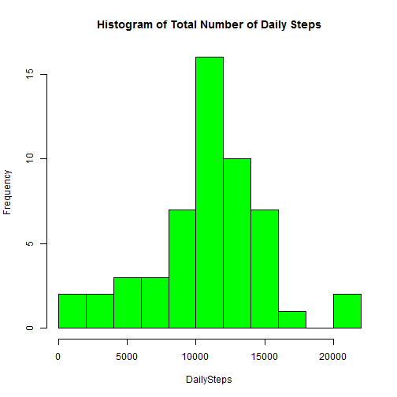
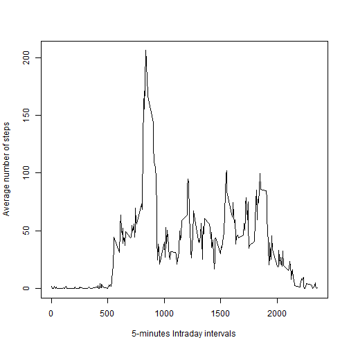
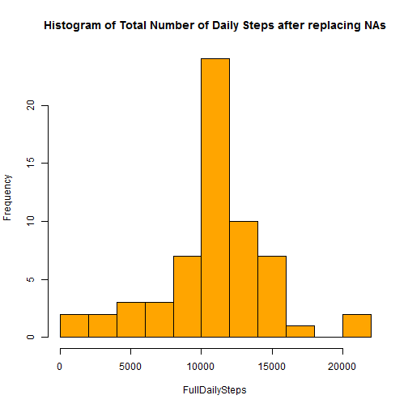
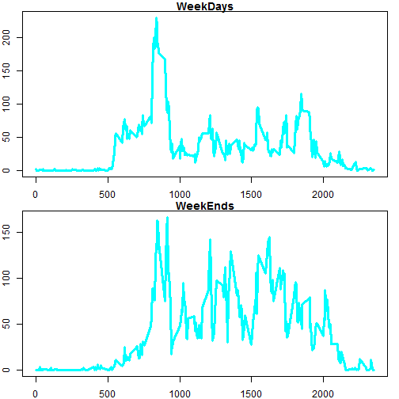

## Loading and preprocessing the data

We begin loadind the data to R.

```r
Activity<-read.csv("activity.csv")
```


## What is mean total number of steps taken per day?
In the first place, lets count the number steps taken by day: 


```r
DailySteps<-tapply(Activity$steps,Activity$date,sum)
print(DailySteps)
```

```
## 2012-10-01 2012-10-02 2012-10-03 2012-10-04 2012-10-05 2012-10-06 
##         NA        126      11352      12116      13294      15420 
## 2012-10-07 2012-10-08 2012-10-09 2012-10-10 2012-10-11 2012-10-12 
##      11015         NA      12811       9900      10304      17382 
## 2012-10-13 2012-10-14 2012-10-15 2012-10-16 2012-10-17 2012-10-18 
##      12426      15098      10139      15084      13452      10056 
## 2012-10-19 2012-10-20 2012-10-21 2012-10-22 2012-10-23 2012-10-24 
##      11829      10395       8821      13460       8918       8355 
## 2012-10-25 2012-10-26 2012-10-27 2012-10-28 2012-10-29 2012-10-30 
##       2492       6778      10119      11458       5018       9819 
## 2012-10-31 2012-11-01 2012-11-02 2012-11-03 2012-11-04 2012-11-05 
##      15414         NA      10600      10571         NA      10439 
## 2012-11-06 2012-11-07 2012-11-08 2012-11-09 2012-11-10 2012-11-11 
##       8334      12883       3219         NA         NA      12608 
## 2012-11-12 2012-11-13 2012-11-14 2012-11-15 2012-11-16 2012-11-17 
##      10765       7336         NA         41       5441      14339 
## 2012-11-18 2012-11-19 2012-11-20 2012-11-21 2012-11-22 2012-11-23 
##      15110       8841       4472      12787      20427      21194 
## 2012-11-24 2012-11-25 2012-11-26 2012-11-27 2012-11-28 2012-11-29 
##      14478      11834      11162      13646      10183       7047 
## 2012-11-30 
##         NA
```

Now, lets create histogram of steps taken each day.


```r
hist(DailySteps,col="green",breaks=10, main="Histogram of Total Number of Daily Steps")
```

 

Finally, lets compute the daily mean and median


```r
mean(DailySteps,na.rm = TRUE)
```

```
## [1] 10766.19
```

```r
median(DailySteps,na.rm = TRUE)
```

```
## [1] 10765
```

## What is the average daily activity pattern?

Now, lets calculate the average number of steps for each 5-minute interval, and then plot how the numbers of steps vary among the day.

```r
MeanIntraDailySteps<-tapply(Activity$steps,Activity$interval,mean,na.rm=TRUE)
plot(unique(Activity$interval),MeanIntraDailySteps,type="l", xlab="5-minutes Intraday intervals", ylab = "Average number of steps")
```

 

Now, we obtain the interval when in average the largest quantity of steps are made.  


```r
MaxInt<-as.numeric(names(which.max(MeanIntraDailySteps)))
print(MaxInt)
```

```
## [1] 835
```
To transform this to a time of the day we perform next operation:


```r
Hour<-floor(MaxInt/100)
Minute<-MaxInt%%100
```
Then, the 5 minutes interval with most steps in average is at 8 hours and 35 Minutes.

## Imputing missing values

First, lets calculate haw many missing values are in the dataset.

```r
sum(is.na(Activity$steps))
```

```
## [1] 2304
```
Lets fill the missing values with the average value of the corresponding day 5-minute interval, and create a new Data Frame called ActiviyFull that contains the replaced values.

```r
#Creates a new vector with the mean vaules per interval
MeanValues<-cbind(as.numeric(names(MeanIntraDailySteps)),MeanIntraDailySteps)
#Creates a vector that replace the missing values with the mean values per interval
ReplaceVector<-MeanValues[match(Activity$interval[is.na(Activity$steps)],MeanValues),2]
#Duplicate the dataframe
ActivityFull<-Activity
#Replace the missing values of the new dataframe with the previously created vector of mean values per interval.
ActivityFull$steps[is.na(ActivityFull$steps)]<-ReplaceVector
```

Now, using this new DataFrame, we plot again the histogram.

```r
FullDailySteps<-tapply(ActivityFull$steps,ActivityFull$date,sum)
hist(FullDailySteps,col="orange",breaks=10, main="Histogram of Total Number of Daily Steps after replacing NAs")
```

 

And finally, we compute again the mean and the median.

```r
mean(FullDailySteps)
```

```
## [1] 10766.19
```

```r
median(FullDailySteps)
```

```
## [1] 10766.19
```
We can see that the mean remains equal given the method of filling the NAs, which replaced the missing values with mean values of the original DataSet. However, this replacement does affect the median, as now there are more days that are taken into account into the sample.

## Are there differences in activity patterns between weekdays and weekends?

Lets introduce a new variable in the Dataset indicatig if a given day is a Week-Day or a Weekend day.


```r
#Make a copy of the DataFrame
ExtendedActivity<-ActivityFull
#Convert the date colum from factor to date class
ExtendedActivity$date<-as.Date(ExtendedActivity$date)
#Find the day of the week and create a dataframe that assigns to each day of the week the category of WeekDay and WeekEnd accordanly.
day<-weekdays(ExtendedActivity$date)
DayDF<-cbind(unique(day),c("WeekDay","WeekDay","WeekDay","WeekDay","WeekDay","WeekEnd","WeekEnd"))
#Create the new column in the data set classifying each day in WeekDay or WeekEnd
ExtendedActivity$Day<-DayDF[match(day,DayDF),2]

head(ExtendedActivity,n=3)
```

```
##       steps       date interval     Day
## 1 1.7169811 2012-10-01        0 WeekDay
## 2 0.3396226 2012-10-01        5 WeekDay
## 3 0.1320755 2012-10-01       10 WeekDay
```

Now, lets plot the  behavior of steps within each day for Weekdays and Weekends.

```r
#Create the 5-minute interval average vector for WeekDAys and WeekEnds
MeanIntraWeekDays<-tapply(ExtendedActivity$steps[ExtendedActivity$Day=="WeekDay"],ExtendedActivity$interval[ExtendedActivity$Day=="WeekDay"],mean,na.rm=TRUE)

MeanIntraWeekEnds<-tapply(ExtendedActivity$steps[ExtendedActivity$Day=="WeekEnd"],ExtendedActivity$interval[ExtendedActivity$Day=="WeekEnd"],mean,na.rm=TRUE)

#Create the plot
par(mfrow=c(2,1), mar=c(2,2,1,1))
plot(unique(ExtendedActivity$interval),MeanIntraWeekDays,type="l",main="WeekDays", xlab="5-minutes Intraday intervals", ylab = "Average number of steps", col="cyan",lwd=3)
plot(unique(ExtendedActivity$interval),MeanIntraWeekEnds,type="l",main="WeekEnds", xlab="5-minutes Intraday intervals", ylab = "Average number of steps", col="cyan",lwd=3)
```

 
